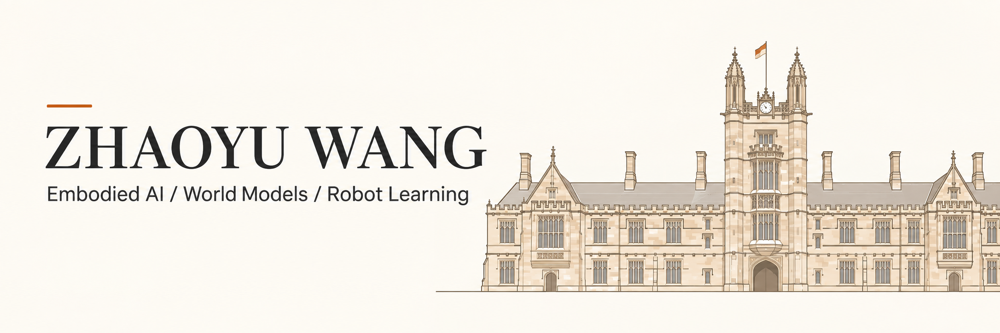

# Hi, I'm Zhaoyu Wang · 王兆宇

**Exploring how machines perceive, remember, and act.**

Research with the Embodied Intelligence Group at **Zhejiang University** 
Studied Computer Science at **The University of Sydney**

  <a href="https://www.sydney.edu.au/">
    <picture>
      <source media="(prefers-color-scheme: dark)" srcset="assets/university-of-sydney-logo-white.svg" />
      
    </picture>
  </a>

[Research](#user-content-selected-research) · [Public Code](#user-content-public-code) · [Education](#user-content-education) · [Contact](#user-content-contact)

---

## About me

I work on **embodied intelligence**, with a focus on tactile world models and learning actions from video. Since June 2026, I have been conducting research with the Embodied Intelligence Group at Zhejiang University, advised by **Linchao Zhu**.

Previously, I explored memory-augmented reasoning for large language models at the University of Sydney. My background also spans knowledge graphs, Java backend development, and research prototyping.

I am interested in connecting **multimodal perception, memory, and action** to build agents that can reason about and interact with the physical world.

| World models | Learning actions | Memory & reasoning |
| :--- | :--- | :--- |
| Joint video and tactile prediction | Inverse dynamics and video-to-action learning | Dynamic memory activation and forgetting |
| Physical consistency across modalities | Egocentric action inference and VTLA | Context retention in multi-step tasks |

## Selected research

### Tactile world models & video-to-action learning

**Zhejiang University · Embodied Intelligence Group** 
June 2026 – Present · Advisor: Linchao Zhu

- Contribute to extending a Cosmos-based world model with tactile inputs and outputs, aiming to improve the physical consistency of its predictions.
- Develop a tactile variational autoencoder (VAE) for joint **video + tactile prediction**, conditioned on an initial image, actions, and a text prompt.
- Lead the development of inverse dynamics models (IDMs) and fine-tuning of the Cosmos-based IDM to support **action-data generation from video**.
- Lead the development and training of general-purpose egocentric inverse dynamics models.
- Contribute to downstream **vision–tactile–language–action (VTLA)** training using project-generated data.

### Memory-augmented reasoning for LLMs

**The University of Sydney · AI Capstone Research Project** 
March 2025 – November 2025 · Advisor: Monica Long

- Proposed a memory-augmented reasoning framework inspired by the brain's silent-activation, memory-retrieval, and inhibition mechanisms.
- Designed and implemented a dual-memory architecture with an **Active Buffer** and a **Silent Buffer**, supporting dynamic activation and automatic forgetting.
- Built an experimental prototype and evaluated reasoning on **HotpotQA** and **Mastermind**, focusing on context retention and logical consistency.

### Knowledge graphs for public-service equalization

**Hebei University of Economics and Business · E-commerce Research Group** 
October 2019 – June 2022 · Advisor: Weihong Wang

- Contributed backend data processing and system integration to a knowledge graph for public-service equalization across Beijing, Tianjin, and Hebei.
- Designed database schemas and RESTful APIs for unified access to data from multiple sources.
- Used **Neo4j** for question answering and visual exploration of knowledge relationships.
- Helped implement and refine an **entropy-weighted TOPSIS** model for evaluating education-resource allocation. The project received a software copyright registration in China.

## Public code

### [equalization — Public-service knowledge graph](https://github.com/ZhaoyuWang530454704/equalization)

A public code repository from my work on public-service equalization, bringing together backend services, knowledge-graph question answering, and data visualization.

**Stack:** Java · Spring / Spring MVC · MyBatis · Neo4j · Thymeleaf

The repository provides selected project modules; some parts of the web module are not publicly released.

## Technical toolkit

| Area | Experience |
| :--- | :--- |
| Research | World models, tactile VAEs, inverse dynamics, VTLA, LLM memory systems |
| Programming | Python, Java, C++, SQL |
| Backend & data | Spring Boot, Spring MVC, MyBatis, RESTful APIs, Neo4j |
| Prototyping | Experimental evaluation, data pipelines, visualization, AI-assisted development |

## Education

| Institution | Field | Period |
| :--- | :--- | :--- |
| **The University of Sydney** | Computer Science | Feb 2024 – Feb 2026 |
| **Hebei University of Economics and Business** | Software Engineering | Sep 2019 – Jun 2023 |

## Beyond research

- **Teaching & mentoring · Jun 2020 – Jun 2022:** Assisted with undergraduate project training in the Software Association Laboratory at Hebei University of Economics and Business, covering Java backend development, Android, Spring Boot, and machine learning.
- **Backend engineering internship · Jun 2022 – Jan 2023:** Worked in an outsourced Java backend role at Nokia in Chengdu, contributing to data integration, APIs, and monitoring-data pipelines for a Sichuan Earthquake Administration project.
- **Recognition:** Provincial First Prize in the Lanqiao Cup; multiple software copyright registrations and university innovation/programming awards.

<strong>中文简介</strong>

我叫王兆宇，曾在悉尼大学学习计算机科学，目前在浙江大学具身智能课题组开展研究，导师为朱霖潮。我的研究重点是触觉世界模型、从视频恢复动作的逆动力学模型，以及视觉—触觉—语言—动作（VTLA）学习。

此前，我在悉尼大学参与大语言模型记忆与推理研究，设计了由 Active Buffer 与 Silent Buffer 组成的双层记忆系统，并在 HotpotQA 和 Mastermind 任务上开展实验。我也有知识图谱、Java 后端开发和本科生项目指导经历。

## Contact

For research discussions and collaboration: **[tomatoin@163.com](mailto:tomatoin@163.com)**

Interested in tactile world models, video-to-action learning, or memory-augmented reasoning? I'd be glad to connect.
